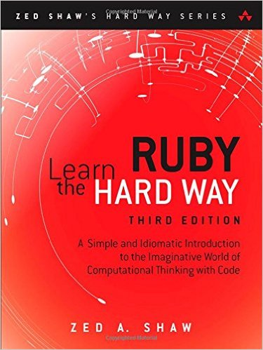

Week 3 and 4 Challange 1 : Complete a ruby tutorial

File structure :

		lrthw  
  		├── chap01   
  		│   ├── ex1.rb  
  		│   └── ex2.rb  
  		└── chap02  
      		├── ex1.rb  
      		└── ex2.rb

To run the script use,type the following at the prompt in its current folder
```shell
ruby <filename>
```
<p align="center">
  
</p>
[//]: # ()
[//]: # (This does not center the image)
